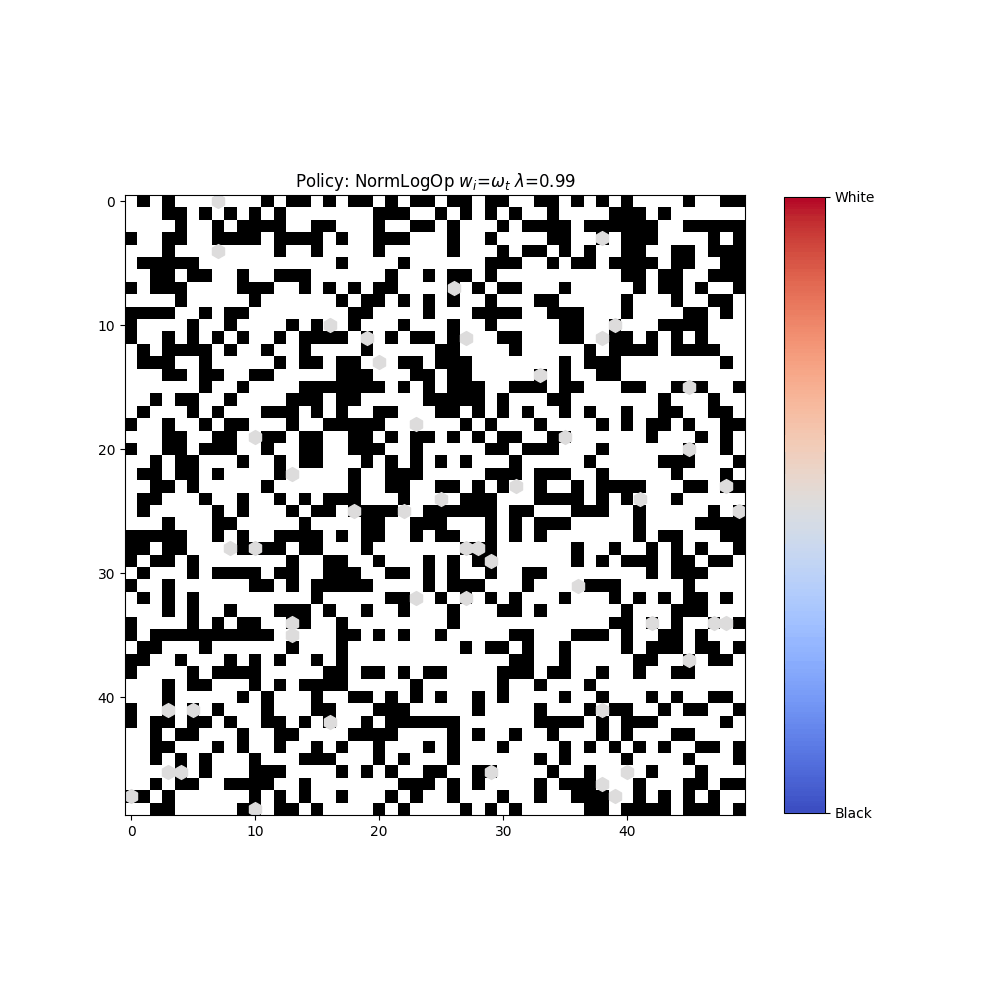

# DeepSets Reinforcement Learning for Opinion Pooling

This codebase and `swarmi` package accompanies our work on learning opinion pooling operators for multi-agent, multi-hypothesis social learning. Traditional pooling methods rely on fixed heuristics or axioms, which can limit flexibility and generalisation. We propose a reinforcement learning-based approach that learns pooling operators end-to-end using DeepSets neural networks, enabling flexible and data-driven aggregation of agent beliefs. Our method outperforms classical pooling strategies across diverse settings and generalises to varying numbers of agents. We also analyze the learned representations to gain insight into effective pooling behavior.

We open source in this repository the code and data used in our experiments, along with the neural network architectures for reproducing the results. Below you can see an example video of the problem domain, where multiple agents must share beliefs about their observations of two distinct hypotheses to achieve consensus.

  

